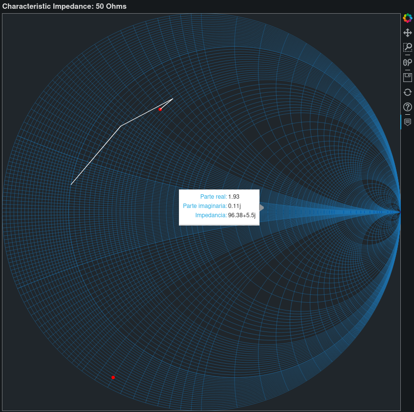

## **Interactive Smith Chart**
---
Generates an interactive smith chart where you see real and imaginary part of the reflection coefficient, also the impedance in that point is shown.

Main credits are for [qnzy](https://github.com/qnzy) who made a minimalistic one, which can be found [here](https://github.com/qnzy/smith.py). I took the class and modified it to plot with bokeh library.

---
Example usage:

```python
  import smith
  smith = smith()
  smith.markZ(20+30j)
  smith.markZ(2-30j)
  smith.markZarray(np.array([20+30j,20+35j,15+20j,10+5j]))
  smith.save()
  ```

The output file it's like this:



As was said, it requires bokeh library.

---

### Functions:
<ul>
<li>In the class declaration, you can pass the value of Z0 and the chart size. By default, those values are 50Ω and 850.</li>
<li><strong>markZ</strong>: marks a dot for a given impedance. Also, accepts color (red by default) as second parameter and size of the dot as third (7 by default).</li>
<li><strong>markZarray</strong>: join with a line the arguments of a given array. Also accepts a change of color (white by default).</li>
<li><strong>save</strong>: saves the plot as an html file. By default, the name will be "smithChart.html".</li>
<li>
<strong>z2gamma</strong>: helpful to extract the reflection coefficient of a given impedance.
</li>
</ul>